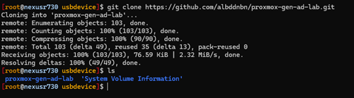

# Gen-AD-Lab-PVE
   

A collection of bash/powershell scripts to generate an Active Directory lab in Proxmox.

## Table of Contents

- [Introduction](#introduction)
- [Features](#features)
- [Installation](#installation)
- [Usage](#usage)
- [Configuration](#configuration)
- [Scripts](#scripts)
- [Example](#example)
- [Resources](#resources)
- [Issues](#issues)
- [License](#license)

## Introduction

This project is a collection of bash and PowerShell scripts that can be used to generate an Active Directory lab in Proxmox.
The new_vm.sh bash script is used first to generate a Domain Controller VM and corresponding virtual network elements.
The Step1.ps1 Powershell script is used afterwards, to configure basic elements of an Active Directory Domain Controller. Step1.ps1 creates a scheduled task for Step2.ps1 which is run after reboot/login. Step2.ps1 creates the same type of scheduled task to execute Step3.ps1.

## Features

- Create a Domain Controller VM in Proxmox
- Create a virtual network in Proxmox
- Configure DNS, DHCP, AD DS, and file shares on the Domain Controller VM
- Generate Active Directory OU/Group/User objects using values from ./config directory

## Installation

To install the scripts, clone the repository and navigate to the directory:

```sh
git clone https://github.com/albddnbn/proxmox-gen-ad-lab.git
cd proxmox-gen-ad-lab
## allow shell script(s) to be executed
chmod +x ./*.sh
```

## Usage

### First, run new_vm.sh
<b>VMs created using this script prompt for many values, but some settings are explicitly hard-coded based on recommendations from various articles, like this one: https://davejansen.com/recommended-settings-windows-10-2016-2018-2019-vm-proxmox/</b>

new_vm.sh will do a few things:

1. Virtual network/gateway through the use of Proxmox's SDN feature with ability to switch Internet access on/off instantaneously.
2. VM in Proxmox using combination of configuration variables and known-good settings. At this point, the script will target the specified storage drive and list a menu of iso's. This allows the user to select their Windows Server iso, and then the VirtIO iso containing drivers necessary to use certain storage types.
3. Using a template and Proxmox's built-in API, basic firewall rules necessary for an Active Directory domain controller are applied to the VM created and enabled.

### Second, run Step1.ps1 directly on the Domain Controller VM. The easiest way I've found to accomplish this so far is to put the repo on a USB drive, and attach the USB drive to the VM.

This way, the VM will be able to run Step1.ps1, and access Steps 2 and 3 on reboot/login.

## Configuration
You can configure Active Directory domain-related settings in the config.ps1 file. This file is dot-sourced at the beginning of each of the 'step' scripts to introduce the configuration variables. I decided to use a .ps1 file / variables for configuration rather than a JSON, so that I could easily comment and add instructions to the config file.

<b>Configure the number of random AD users created through the <i>create_user_population.ps1</i> script's parameters.</b> By default the number of users created is 50, I would not advise beyond 1000 at this point in time due to size of the user_data.csv file.

[Configure number of users](img/specify_num_users_012.png)

## Scripts

#### Step 1 / Step1.ps1:
- domain controller's hostname, static IP address info, DNS Settings
- script will search attached drives for virtio msi installer (necessary for usage of virtio virtual hardware devices including network adapter)

#### Step 2 / Step2.ps1:
- Installs AD DS with DNS server
- configures new AD DS Forest and Domain Controller role

#### Step 3 / Step3.ps1:
- Installs and configures DHCP Server with single DHCP scope
- Creates AD DS OUs, Groups, Users
- Creates file shares for roaming profiles/folder redirection and configures permissions
- Installs/configures MDT Server and dependencies
- Imports VirtIO Drivers using virtio iso

## Example

For new_vm.sh screenshots - see README file of other repo: [https://github.com/albddnbn/proxmox-ve-utility-scripts](https://github.com/albddnbn/proxmox-ve-utility-scripts)

1. Format a USB drive as FAT32 using the utility of your choice and physically attach it to the server/computer running Proxmox VE.

2. Connect to Proxmox via SSH and list storage devices on machine to pinpoint your USB device:


3. Mount the USB drive to a directory of your choice, and clone this repository:




4. <b>After installing Windows Server on the virtual machine</b>, unmount the USB device and add it to the newly created VM. In this example, the VM ID of my Domain Controller VM is <b>701</b>. There are a few different ways to attach a physical USB device to a VM running in Proxmox.

In this example, I'm extracting the ID of the USB device and using it with the <b>qm command-line utilty</b> to make the attachment.


5. When you start up the Virtual Machine - you should be able to see your USB device in File Explorer:


6. <b>Configure the ./config/config.ps1 file to set your Domain name and other important variables.</b>


7. Run Step1.ps1 on the Domain Controller VM.


8. Reboot to apply changes (static IP addressing, new hostname, enabled file/printer sharing, etc.):


9. After reboot, log back in and Step2.ps1 should start up automatically:


10. The machine will reboot automatically after step2 has finished. <b>Step3.ps1 will run on next login after reboot.</b>

If you are now allowed to login to your newly created domain, it's a sign that Step 2 likely completed successfully.


Logging in will initiate the last step, Step3.ps1.

## Resources

## Issues

1. Check on possibility that Step 3 scheduled task not properly removed during script.

2. Try to decrease level of human interaction required in process (mostly the powershell script/steps).

## Coming Soon:

- Improvement of MDT configuration - task sequence/applications/etc.
- Installation/Configuration of WDS
- Installation/Configuration of WSUS

## License

This project is licensed under the GNU General Public License v2.0. You may obtain a copy of the License at

[https://www.gnu.org/licenses/gpl-2.0.en.html](https://www.gnu.org/licenses/gpl-2.0.en.html)

This program is free software: you can redistribute it and/or modify it under the terms of the GNU General Public License as published by the Free Software Foundation, either version 3 of the License, or (at your option) any later version.

This program is distributed in the hope that it will be useful, but WITHOUT ANY WARRANTY; without even the implied warranty of MERCHANTABILITY or FITNESS FOR A PARTICULAR PURPOSE. See the GNU General Public License for more details.

